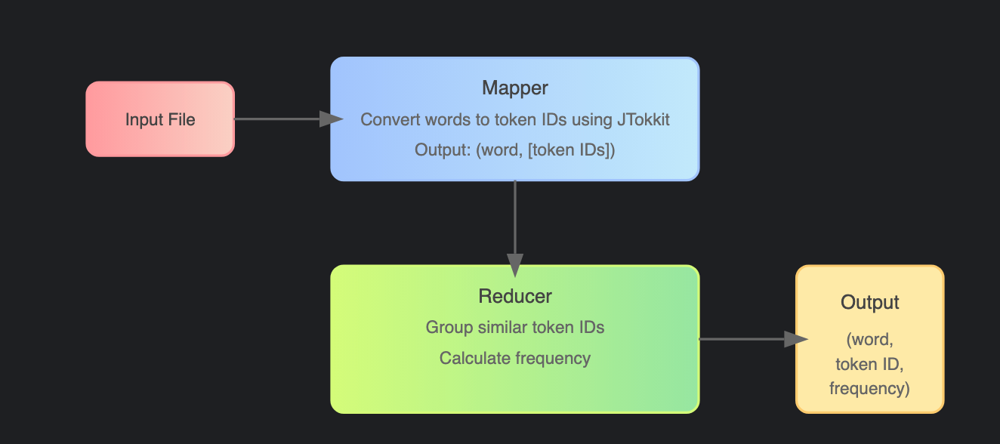
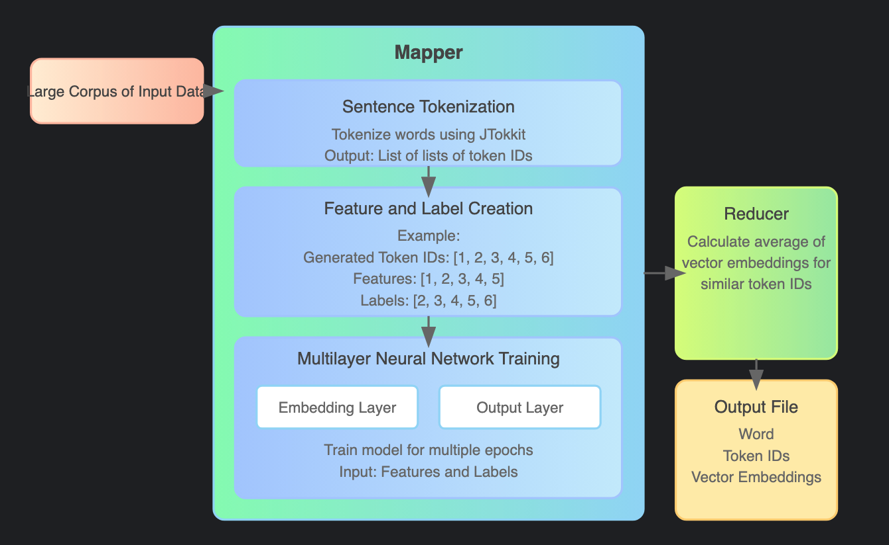

# Building Large Language Model(LLM) from Scratch
#### Author: Niharika Belavadi Shekar
#### UIN :   675234184
#### Email: nbela@uic.edu
#### Instructor: Mark Grechanik


## Project Summary
This project involves building a Large Language Model(LLM) using Cloud computing technologies. Initially, this includes text tokenization and vector embeddings computation using Hadoop MapReduce. So, this project has two parts, the first one is tokenizing the words using JTokkit and the second is producing vector embeddings for the words using MultiLayerNetwork model. So, the flow of the work in order to achieve this, is we first take a large corpus of text data and then produce token IDs for each word in the text data using JTokkit. We are implementing a Map Reduce program here to get token IDs for each word and then use a reducer to get frequency of the words. We write the output to one of the output files, containing word, its Token ID and frequency. Following this, another Map Reduce program is written to take the input data, tokenize the sentences producing list of Token ID arrays, which is then fed to the MultiLayer Network model for training. This Model includes two important layers, an embedding layer and an output layer. The tokens and its corresponding label(that is the next consecutive word) are fed into model and the model should be trained for good number of epochs for the model to learn thoroughly. Later, we use a reducer to take average values of the vectors for similar tokens(i.e., for same words) and the average value is generated for the token. Therefore, the second output file contains the word, its Token ID and its vector embedding. So, this is the basic logic that is getting implemented. Now, we run the programs in Amazon Elastic Map Reduce(EMR) by using S3 to store our input/output files along with the Jar. The input file is divided into a certain number of shards for parallel processing and each shard has a Mapper function to obtain a key-value pair which is later fed into the desired number of reducers to get the final output. The detailed flow of this work is demonstrated in the Youtube video link attached for clear understanding. 

[Youtube Link](https://youtu.be/o8KEDGdCd3w)

## Prerequisites
Below are the required prerequisites to successfully run the project(The operating system used here is Mac)

- **Java 11**: The project requires JDK 11 to be installed.
- **Scala**: Ensure Scala is installed for writing and executing the code.
- **Apache Hadoop 3.3.6**: A locally installed Hadoop environment is needed for running MapReduce jobs.
- **sbt (Scala Build Tool)**: Used for compiling and building the Scala project.
- **DeepLearning4J**: Library for deep learning in Java/Scala.
- **JTokkit**: Tokenizer library for encoding words into tokenIDs.
- **Dataset udes:**: [[Light Novels File]](https://huggingface.co/datasets/alpindale/light-novels?row=2)

Make sure all dependencies and libraries are properly configured for the project.

## Steps to Execute the Project

1. **Clone the Repository**
   Clone the project to your local machine using SSH or HTTPS:
   ```bash
   git clone git@github.com:NiharikaShekar/Building-LLM-from-Scratch.git
   ```

2. **Install Dependencies**
   After cloning the repository, navigate to the project directory and install the necessary dependencies:
   ```bash
   cd Building-LLM-from-Scratch
   sbt clean update
   ```

3. **Build the Project**
   Build the project using `sbt assembly` to compile and package it:
   ```bash
   sbt assembly
   # This will create a fat Jar
   ```
4. Run Unit tests and Integration Tests using below command:
   ```
   sbt test
   ```

5. **Run the Project Locally**
   To run the project locally with Hadoop, execute the following command:
   ```bash
   hadoop jar target/scala-2.13/LLM-hw1-assembly-0.1.0-SNAPSHOT.jar input-path output-path
   ```

6. **Verify Output**
   After running the job, you can check the output path for the embeddings generated for the text file.


7. **Create an AWS EMR Cluster and add files to S3**
Launch an EMR cluster with the following configurations:
* First, create three directories in S3 called input, jar and the output. Here, input file, jar and the output goes into input, jar and output folders respectively. 
* Now, lets create a cluster.
* Instance type: Select an instance type based on your specific processing requirements (e.g., m5.xlarge).
* Application: Install Hadoop only.
* Add steps, one for Toeknizing and other for Embedding vectors.
   * Tokenizer step:
      * Jar location: [input S3 common JAR path]
      * Jar arguments: TokenID_Generation
   * Embedding step:
      * Jar location: [input S3 common JAR path]
      * Jar arguments: Token_Embeddings
* Now, we start the cluster and the job has been submitted to run.


### TokenID_Generation:

[//]: # (<svg xmlns="http://www.w3.org/2000/svg" viewBox="0 0 800 400">)

[//]: # (  <defs>)

[//]: # (    <linearGradient id="grad1" x1="0%" y1="0%" x2="100%" y2="0%">)

[//]: # (      <stop offset="0%" style="stop-color:#ff9a9e;stop-opacity:1" />)

[//]: # (      <stop offset="100%" style="stop-color:#fad0c4;stop-opacity:1" />)

[//]: # (    </linearGradient>)

[//]: # (    <linearGradient id="grad2" x1="0%" y1="0%" x2="100%" y2="0%">)

[//]: # (      <stop offset="0%" style="stop-color:#a1c4fd;stop-opacity:1" />)

[//]: # (      <stop offset="100%" style="stop-color:#c2e9fb;stop-opacity:1" />)

[//]: # (    </linearGradient>)

[//]: # (    <linearGradient id="grad3" x1="0%" y1="0%" x2="100%" y2="0%">)

[//]: # (      <stop offset="0%" style="stop-color:#d4fc79;stop-opacity:1" />)

[//]: # (      <stop offset="100%" style="stop-color:#96e6a1;stop-opacity:1" />)

[//]: # (    </linearGradient>)

[//]: # (  </defs>)

[//]: # ()
[//]: # (  <!-- Input File -->)

[//]: # (  <rect x="50" y="50" width="120" height="60" rx="10" ry="10" fill="url&#40;#grad1&#41;" stroke="#ff9a9e" stroke-width="2"/>)

[//]: # (  <text x="110" y="85" text-anchor="middle" font-size="14" fill="#444">Input File</text>)

[//]: # ()
[//]: # (  <!-- Mapper -->)

[//]: # (  <rect x="250" y="30" width="300" height="100" rx="10" ry="10" fill="url&#40;#grad2&#41;" stroke="#a1c4fd" stroke-width="2"/>)

[//]: # (  <text x="400" y="60" text-anchor="middle" font-size="16" fill="#444">Mapper</text>)

[//]: # (  <text x="400" y="85" text-anchor="middle" font-size="14" fill="#666">Convert words to token IDs using JTokkit</text>)

[//]: # (  <text x="400" y="110" text-anchor="middle" font-size="14" fill="#666">Output: &#40;word, [token IDs]&#41;</text>)

[//]: # ()
[//]: # (  <!-- Reducer -->)

[//]: # (  <rect x="250" y="200" width="300" height="120" rx="10" ry="10" fill="url&#40;#grad3&#41;" stroke="#d4fc79" stroke-width="2"/>)

[//]: # (  <text x="400" y="230" text-anchor="middle" font-size="16" fill="#444">Reducer</text>)

[//]: # (  <text x="400" y="255" text-anchor="middle" font-size="14" fill="#666">Group similar token IDs</text>)

[//]: # (  <text x="400" y="280" text-anchor="middle" font-size="14" fill="#666">Calculate frequency</text>)

[//]: # ()
[//]: # (  <!-- Output -->)

[//]: # (  <rect x="630" y="200" width="120" height="120" rx="10" ry="10" fill="#ffeaa7" stroke="#fdcb6e" stroke-width="2"/>)

[//]: # (  <text x="690" y="235" text-anchor="middle" font-size="16" fill="#444">Output</text>)

[//]: # (  <text x="690" y="265" text-anchor="middle" font-size="14" fill="#666">&#40;word,</text>)

[//]: # (  <text x="690" y="285" text-anchor="middle" font-size="14" fill="#666">token ID,</text>)

[//]: # (  <text x="690" y="305" text-anchor="middle" font-size="14" fill="#666">frequency&#41;</text>)

[//]: # ()
[//]: # (  <!-- Arrows -->)

[//]: # (  <defs>)

[//]: # (    <marker id="arrowhead" markerWidth="10" markerHeight="7" refX="0" refY="3.5" orient="auto">)

[//]: # (      <polygon points="0 0, 10 3.5, 0 7" fill="#666"/>)

[//]: # (    </marker>)

[//]: # (  </defs>)

[//]: # ()
[//]: # (  <line x1="170" y1="80" x2="240" y2="80" stroke="#666" stroke-width="2" marker-end="url&#40;#arrowhead&#41;"/>)

[//]: # (  <line x1="400" y1="130" x2="400" y2="190" stroke="#666" stroke-width="2" marker-end="url&#40;#arrowhead&#41;"/>)

[//]: # (  <line x1="550" y1="260" x2="620" y2="260" stroke="#666" stroke-width="2" marker-end="url&#40;#arrowhead&#41;"/>)

[//]: # (</svg>)


### Token_Embeddings:

[//]: # (<svg xmlns="http://www.w3.org/2000/svg" viewBox="0 0 800 600">)

[//]: # (  <defs>)

[//]: # (    <linearGradient id="grad1" x1="0%" y1="0%" x2="100%" y2="0%">)

[//]: # (      <stop offset="0%" style="stop-color:#ffecd2;stop-opacity:1" />)

[//]: # (      <stop offset="100%" style="stop-color:#fcb69f;stop-opacity:1" />)

[//]: # (    </linearGradient>)

[//]: # (    <linearGradient id="grad2" x1="0%" y1="0%" x2="100%" y2="0%">)

[//]: # (      <stop offset="0%" style="stop-color:#84fab0;stop-opacity:1" />)

[//]: # (      <stop offset="100%" style="stop-color:#8fd3f4;stop-opacity:1" />)

[//]: # (    </linearGradient>)

[//]: # (    <linearGradient id="grad3" x1="0%" y1="0%" x2="100%" y2="0%">)

[//]: # (      <stop offset="0%" style="stop-color:#a1c4fd;stop-opacity:1" />)

[//]: # (      <stop offset="100%" style="stop-color:#c2e9fb;stop-opacity:1" />)

[//]: # (    </linearGradient>)

[//]: # (    <linearGradient id="grad4" x1="0%" y1="0%" x2="100%" y2="0%">)

[//]: # (      <stop offset="0%" style="stop-color:#d4fc79;stop-opacity:1" />)

[//]: # (      <stop offset="100%" style="stop-color:#96e6a1;stop-opacity:1" />)

[//]: # (    </linearGradient>)

[//]: # (  </defs>)

[//]: # ()
[//]: # (  <!-- Input Corpus -->)

[//]: # (  <rect x="30" y="50" width="160" height="60" rx="10" ry="10" fill="url&#40;#grad1&#41;" stroke="#fcb69f" stroke-width="2"/>)

[//]: # (  <text x="110" y="85" text-anchor="middle" font-size="14" fill="#444">Large Corpus of Input Data</text>)

[//]: # ()
[//]: # (  <!-- Mapper -->)

[//]: # (  <rect x="200" y="20" width="400" height="460" rx="10" ry="10" fill="url&#40;#grad2&#41;" stroke="#8fd3f4" stroke-width="2"/>)

[//]: # (  <text x="400" y="50" text-anchor="middle" font-size="18" font-weight="bold" fill="#444">Mapper</text>)

[//]: # ()
[//]: # (  <!-- Tokenization -->)

[//]: # (  <rect x="220" y="70" width="360" height="80" rx="10" ry="10" fill="url&#40;#grad3&#41;" stroke="#a1c4fd" stroke-width="2"/>)

[//]: # (  <text x="400" y="100" text-anchor="middle" font-size="16" fill="#444">Sentence Tokenization</text>)

[//]: # (  <text x="400" y="125" text-anchor="middle" font-size="14" fill="#666">Tokenize words using JTokkit</text>)

[//]: # (  <text x="400" y="145" text-anchor="middle" font-size="14" fill="#666">Output: List of lists of token IDs</text>)

[//]: # ()
[//]: # (  <!-- Feature and Label Creation -->)

[//]: # (  <rect x="220" y="170" width="360" height="120" rx="10" ry="10" fill="url&#40;#grad3&#41;" stroke="#a1c4fd" stroke-width="2"/>)

[//]: # (  <text x="400" y="195" text-anchor="middle" font-size="16" fill="#444">Feature and Label Creation</text>)

[//]: # (  <text x="400" y="220" text-anchor="middle" font-size="14" fill="#666">Example:</text>)

[//]: # (  <text x="400" y="240" text-anchor="middle" font-size="14" fill="#666">Generated Token IDs: [1, 2, 3, 4, 5, 6]</text>)

[//]: # (  <text x="400" y="260" text-anchor="middle" font-size="14" fill="#666">Features: [1, 2, 3, 4, 5]</text>)

[//]: # (  <text x="400" y="280" text-anchor="middle" font-size="14" fill="#666">Labels: [2, 3, 4, 5, 6]</text>)

[//]: # ()
[//]: # (  <!-- Model Training -->)

[//]: # (  <rect x="220" y="310" width="360" height="150" rx="10" ry="10" fill="url&#40;#grad3&#41;" stroke="#a1c4fd" stroke-width="2"/>)

[//]: # (  <text x="400" y="335" text-anchor="middle" font-size="16" fill="#444">Multilayer Neural Network Training</text>)

[//]: # (  <rect x="240" y="355" width="150" height="40" rx="5" ry="5" fill="#fff" stroke="#8fd3f4" stroke-width="2"/>)

[//]: # (  <text x="315" y="380" text-anchor="middle" font-size="14" fill="#666">Embedding Layer</text>)

[//]: # (  <rect x="410" y="355" width="150" height="40" rx="5" ry="5" fill="#fff" stroke="#8fd3f4" stroke-width="2"/>)

[//]: # (  <text x="485" y="380" text-anchor="middle" font-size="14" fill="#666">Output Layer</text>)

[//]: # (  <text x="400" y="420" text-anchor="middle" font-size="14" fill="#666">Train model for multiple epochs</text>)

[//]: # (  <text x="400" y="440" text-anchor="middle" font-size="14" fill="#666">Input: Features and Labels</text>)

[//]: # ()
[//]: # (  <!-- Reducer -->)

[//]: # (  <rect x="630" y="170" width="150" height="160" rx="10" ry="10" fill="url&#40;#grad4&#41;" stroke="#d4fc79" stroke-width="2"/>)

[//]: # (  <text x="705" y="200" text-anchor="middle" font-size="16" fill="#444">Reducer</text>)

[//]: # (  <text x="705" y="225" text-anchor="middle" font-size="14" fill="#666">Calculate average of</text>)

[//]: # (  <text x="705" y="245" text-anchor="middle" font-size="14" fill="#666">vector embeddings for</text>)

[//]: # (  <text x="705" y="265" text-anchor="middle" font-size="14" fill="#666">similar token IDs</text>)

[//]: # ()
[//]: # (  <!-- Output -->)

[//]: # (  <rect x="630" y="350" width="150" height="130" rx="10" ry="10" fill="#ffeaa7" stroke="#fdcb6e" stroke-width="2"/>)

[//]: # (  <text x="705" y="380" text-anchor="middle" font-size="16" fill="#444">Output File</text>)

[//]: # (  <text x="705" y="405" text-anchor="middle" font-size="14" fill="#666">Word</text>)

[//]: # (  <text x="705" y="425" text-anchor="middle" font-size="14" fill="#666">Token IDs</text>)

[//]: # (  <text x="705" y="445" text-anchor="middle" font-size="14" fill="#666">Vector Embeddings</text>)

[//]: # ()
[//]: # (  <!-- Arrows -->)

[//]: # (  <defs>)

[//]: # (    <marker id="arrowhead" markerWidth="10" markerHeight="7" refX="0" refY="3.5" orient="auto">)

[//]: # (      <polygon points="0 0, 10 3.5, 0 7" fill="#666"/>)

[//]: # (    </marker>)

[//]: # (  </defs>)

[//]: # ()
[//]: # (  <line x1="190" y1="80" x2="190" y2="80" stroke="#666" stroke-width="2" marker-end="url&#40;#arrowhead&#41;"/>)

[//]: # (  <line x1="400" y1="150" x2="400" y2="160" stroke="#666" stroke-width="2" marker-end="url&#40;#arrowhead&#41;"/>)

[//]: # (  <line x1="400" y1="290" x2="400" y2="300" stroke="#666" stroke-width="2" marker-end="url&#40;#arrowhead&#41;"/>)

[//]: # (  <line x1="600" y1="250" x2="620" y2="250" stroke="#666" stroke-width="2" marker-end="url&#40;#arrowhead&#41;"/>)

[//]: # (  <line x1="705" y1="330" x2="705" y2="340" stroke="#666" stroke-width="2" marker-end="url&#40;#arrowhead&#41;"/>)

[//]: # (</svg>)



## Additional Notes
- Ensure that Hadoop is properly configured to run in the local environment.
- You can adjust hyperparameters such as the number of epochs, embedding dimensions, or vocabulary size within the code for different training results.

Feel free to contribute to the project or report any issues you encounter.
